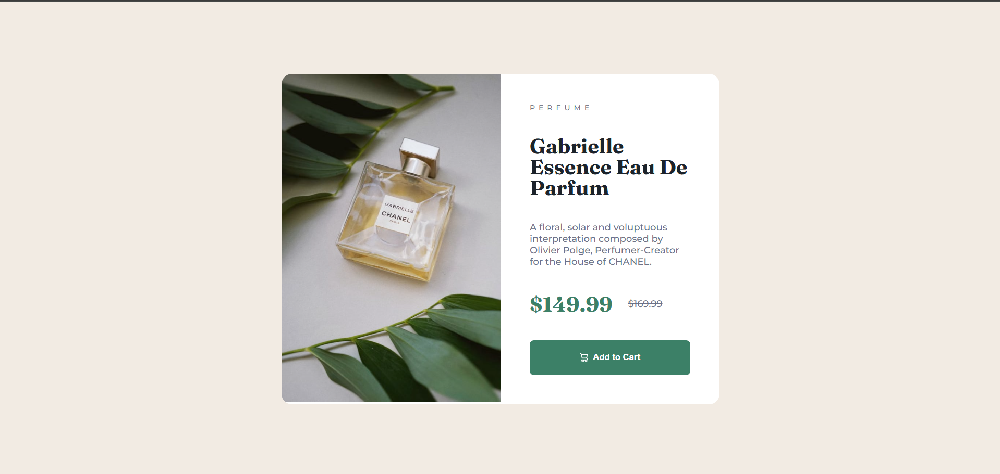

# Frontend Mentor - Product preview card component solution

This is a solution to the [Product preview card component challenge on Frontend Mentor](https://www.frontendmentor.io/challenges/product-preview-card-component-GO7UmttRfa).

## Table of contents

* [Overview](#overview)

  * [Screenshot](#screenshot)
  * [Links](#links)
* [My process](#my-process)

  * [Built with](#built-with)
  * [What I learned](#what-i-learned)
  * [Continued development](#continued-development)
* [Author](#author)

## Overview

### Screenshot



### Links

* [Solution](ADD_FRONTEND_MENTOR_SOLUTION_LINK)
* [Live](ADD_VERCEL_LINK)

## My process

### Built with

* Semantic HTML5 markup
* CSS custom properties
* Flexbox
* CSS Grid
* Responsive Design
* Custom fonts using `@font-face`

### What I learned

Used CSS Grid to create a clean two-column desktop layout that automatically switches to a single-column layout on smaller screens:

```css
.container {
   display: grid;
   grid-template-columns: 1fr 1fr;
}

@media (max-width:48rem) {
   .container {
      grid-template-columns: 1fr;
   }
}
```

Implemented separate desktop and mobile product images to match the design requirements:

```css
.mobile {
   display: none;
}

@media (max-width:48rem) {

   .mobile {
      display: block;
   }

   .desktop {
      display: none;
   }
}
```

Used `overflow: hidden` on the card container to ensure the image respects the parent's border radius without additional styling:

```css
.container {
   border-radius: 1em;
   overflow: hidden;
}
```

Practiced working with local variable fonts using `@font-face` instead of relying on external font services:

```css
@font-face {
   font-family: 'Montserrat';
   src: url('./assets/Montserrat/Montserrat-VariableFont_wght.ttf')
        format('truetype');
}
```

### Continued development

* Continue improving responsive layout skills through Frontend Mentor challenges
* Practice CSS Grid in more complex layouts
* Learn JavaScript to add interactivity to future projects
* Build larger projects that combine responsive design and dynamic functionality

## Author

* Frontend Mentor - [@bangarukondabollapally](https://www.frontendmentor.io/profile/bangarukondabollapally)
* GitHub - [@bangarukondabollapally](https://github.com/bangarukondabollapally)
